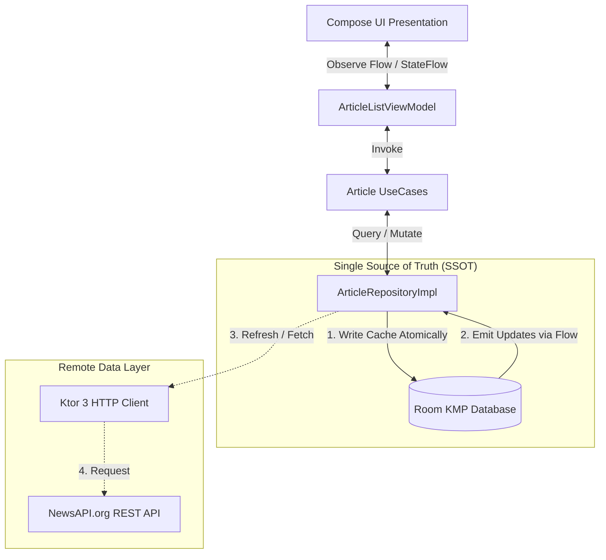

# 📰 News Reader App - Kotlin Multiplatform (KMP) & Compose Multiplatform

[](https://kotlinlang.org)
[](https://www.jetbrains.com/lp/compose-multiplatform/)
[](https://developer.android.com/kotlin/multiplatform/room)
[](https://ktor.io/)
[](https://insert-koin.io/)
[](https://coil-kt.github.io/coil/)
[-brightgreen.svg)]()

Aplikasi pembaca berita modern (*News Reader*) berbasis **Kotlin Multiplatform (KMP)** dan **Compose Multiplatform** yang berjalan secara *native* di **Android** dan **iOS** dengan 100% kode *shared* untuk Data Layer, Domain Layer, dan Presentation (UI) Layer.

Aplikasi ini menerapkan **Clean Architecture**, prinsip **Offline-First Single Source of Truth (SSOT)** menggunakan **Room KMP 2.7.x**, *dependency injection* modern dengan **Koin 4.x**, *network client* multiplatform dengan **Ktor 3.x**, dan *asynchronous image loading* dengan **Coil 3**.

---

## 📑 Daftar Isi
- [Tech Stack & Dependencies](#-tech-stack--dependencies)
- [Arsitektur & Alur Data](#-arsitektur--alur-data)
  - [Clean Architecture Overview](#clean-architecture-overview)
  - [Offline-First Single Source of Truth (SSOT)](#offline-first-single-source-of-truth-ssot)
  - [Smart Fallback Mechanism](#smart-fallback-mechanism)
- [Fitur Aplikasi](#-fitur-aplikasi)
- [Panduan Setup & Konfigurasi API Key](#-panduan-setup--konfigurasi-api-key)
- [Cara Menjalankan Aplikasi & Pengujian](#-cara-menjalankan-aplikasi--pengujian)
  - [Menjalankan Aplikasi](#menjalankan-aplikasi)
  - [Menjalankan Unit Test & UI Test](#menjalankan-unit-test--ui-test)
- [Catatan Penggunaan Agentic AI (AI-Assisted Development)](#-catatan-penggunaan-agentic-ai-ai-assisted-development)
- [Author](#-author)

---

## 🛠️ Tech Stack & Dependencies

| Kategori | Library / Framework | Versi | Deskripsi & Peran |
| :--- | :--- | :--- | :--- |
| **Language** | Kotlin Multiplatform | `2.1.10` | Bahasa utama multiplatform (Android & iOS) |
| **UI Framework** | Compose Multiplatform | `1.7.3` | Deklaratif UI terbagi penuh antara Android & iOS |
| **Design System** | Material Design 3 | `1.7.3` | Dynamic Light & Dark Theme, Typography, M3 Components |
| **Navigation** | Navigation Compose KMP | `2.8.0-alpha10` | Navigasi deklaratif antar layar dengan *safe parameter encoding* |
| **Local Database** | AndroidX Room KMP + SQLite Bundled | `2.7.0-alpha13` | Penyimpanan lokal SQLite terenkapsulasi sebagai Single Source of Truth |
| **Network Client** | Ktor Client 3.x | `3.1.1` | HTTP client multiplatform (OkHttp engine di Android, Darwin di iOS) |
| **Serialization** | Kotlinx Serialization JSON | `1.8.0` | Parsing JSON DTO NewsAPI secara efisien |
| **Dependency Injection**| Koin Multiplatform | `4.0.2` | DI deklaratif dengan dukungan Koin ViewModel & Compose Multiplatform |
| **Image Loading** | Coil 3 Multiplatform | `3.1.0` | Async image caching & loading terintegrasi Ktor 3 |
| **Asynchrony** | Kotlin Coroutines & Flow | `1.10.1` | Aliran data reaktif dan manajemen *concurrency* |
| **Date & Time** | Kotlinx Datetime | `0.6.2` | Formatting tanggal ISO 8601 ke format waktu ramah pengguna |
| **Testing Stack** | JUnit 4, MockK, Turbine, Compose UI Test | `4.13.2` / `1.13.17` | Pengujian komprehensif (Unit Test, Flow Testing, UI Instrumentation) |

---

## 🏛️ Arsitektur & Alur Data

### Clean Architecture Overview
Struktur kode dipisahkan menjadi layer yang terisolasi dan modular di direktori `shared/commonMain`:

```
com.samsul.inosoftapps/
├── domain/                          # Pure Business Logic (No External Frameworks)
│   ├── model/                       # Domain Models (Article, DomainError, ResultState)
│   ├── repository/                  # Repository Interfaces (ArticleRepository)
│   └── usecase/                     # Use Cases (Get, Refresh, Detail, Search)
├── data/                            # Data Providers & Implementation
│   ├── remote/                      # Ktor API Service, DTOs & Smart Fallback
│   ├── local/                       # Room KMP Database, DAO, Entities & Platform Builders
│   ├── mapper/                      # DTO <-> Entity <-> Domain Mappers & Date Formatter
│   └── repository/                  # Repository Implementations (SSOT Handler)
├── di/                              # Koin Dependency Injection Modules
├── presentation/                    # Compose Multiplatform UI
│   ├── component/                   # Reusable Components (ArticleCard, LoadingView, etc.)
│   ├── navigation/                  # Routes, Screen sealed class & NavGraph
│   ├── screen/                      # Stateful Screens & Stateless Content
│   ├── theme/                       # Material 3 Color, Type & Theme
│   ├── util/                        # Preview Sample Data Provider
│   └── viewmodel/                   # StateFlow ViewModels (List & Detail)
└── App.kt                           # Root Application Entry Point
```

---

### Offline-First Single Source of Truth (SSOT)

Aplikasi menerapkan konsep **Offline-First Single Source of Truth (SSOT)**:
1. **UI Selalu Mengamati Database Lokal (Room DB)**: Tampilan UI secara reaktif mengonsumsi `Flow<List<Article>>` dari database lokal Room.
2. **Sinkronisasi Remote ke Lokal**: Saat proses *refresh* (atau inisialisasi aplikasi), Ktor API mengambil berita terkini dari NewsAPI dan menyimpannya secara atomik (`@Transaction clearAndInsert`) ke dalam Room DB.
3. **Ketahanan Mode Offline**: Apabila internet terputus atau koneksi *timeout*, data cache di database Room **tidak akan terhapus**. UI tetap menampilkan berita tersimpan dan menampilkan banner halus **'Mode Offline'** disertai notifikasi *Snackbar* non-blocking.



---

### Smart Fallback Mechanism
Jika API mengembalikan respons kosong atau error saat memfilter berita negara tertentu (misalnya `country=id`), `KtorNewsApiService` secara otomatis melakukan *fallback* cerdas mengambil berita utama global (`country=us`) agar layar pengguna tidak kosong dan tetap menyajikan konten berita terbaru.

---

## ✨ Fitur Aplikasi

### Fitur Utama
- [x] **Top Headlines Feed**: Menampilkan daftar berita terkini dengan gambar thumbnail, judul (max 2 baris), deskripsi ringkas, badge media sumber, dan tanggal terbit.
- [x] **Filter Kategori Dinamis**: Pilihan kategori (*Semua, Bisnis, Teknologi, Olahraga, Kesehatan, Sains, Hiburan*) dengan chips interaktif.
- [x] **Offline-First Caching**: Berita disimpan otomatis di SQLite lokal sehingga dapat dibaca kapan saja tanpa koneksi internet.
- [x] **Pencarian Lokal Reaktif**: Fitur pencarian instan berdasarkan kata kunci pada judul maupun deskripsi artikel yang ada di cache.
- [x] **Pull-to-Refresh Gesture**: Gesture tarik ke bawah menggunakan Material 3 `PullToRefreshBox` untuk memperbarui berita.
- [x] **Banner Mode Offline**: Indikator animasi otomatis saat berada dalam mode offline tanpa mengganggu pengalaman membaca.
- [x] **Non-Blocking Error Snackbar**: Pesan kesalahan koneksi disajikan secara elegan melalui *Snackbar* tanpa menutupi konten.
- [x] **Halaman Detail Lengkap**: Menyajikan gambar *hero* besar, nama penulis, tanggal terbit lokal (*WIB*), isi konten lengkap, dan tautan artikel asli.
- [x] **Material 3 Light & Dark Theme**: Tampilan responsif yang otomatis menyesuaikan tema gelap atau terang perangkat.

### Fitur Bonus
- [x] **Modal Full-Screen Image Viewer**: Mengklik thumbnail atau gambar *hero* membuka dialog modal resolusi penuh dengan latar belakang redup (*backdrop dim*) dan tombol tutup.
- [x] **Safe Navigation Parameter Encoding**: URL artikel atau karakter khusus (`/`, `?`, `&`, `#`) di-encode dengan `encodeFull = true` pada Navigation Compose sehingga bebas dari *routing crashes*.
- [x] **Stateless UI Decomposition & @Preview**: Pemisahan `ArticleListContent` dan `ArticleDetailContent` yang memungkinkan *preview visual* instan di Android Studio (mode *Light* dan *Dark*) dengan data sampel realistis.

---

## 🔑 Panduan Setup & Konfigurasi API Key

1. **Dapatkan API Key**:
   Daftar secara gratis di [NewsAPI.org](https://newsapi.org) untuk mendapatkan API Key.

2. **Salin File Konfigurasi**:
   Salin file `local.properties.example` menjadi `local.properties` pada *root* project:
   ```bash
   cp local.properties.example local.properties
   ```

3. **Isi API Key**:
   Buka `local.properties` dan masukkan API Key Anda:
   ```properties
   sdk.dir=/Users/username/Library/Android/sdk
   NEWS_API_KEY=masukkan_api_key_newsapi_anda_disini
   ```

> [!NOTE]
> Jika `local.properties` tidak diisi, aplikasi telah dilengkapi dengan default key fallback pada `NewsConfig.kt` untuk keperluan pengujian dan evaluasi langsung.

---

## 🚀 Cara Menjalankan Aplikasi & Pengujian

### Menjalankan Aplikasi

#### 1. Android
Jalankan perintah berikut untuk meng-compile dan meng-install aplikasi Android:
```bash
# Build APK Debug
./gradlew :androidApp:assembleDebug

# Install dan jalankan ke perangkat / emulator Android yang terhubung
./gradlew :androidApp:installDebug
```
*Atau buka project di **Android Studio** dan klik tombol **Run** pada modul `androidApp`.*

#### 2. iOS
Jalankan kompilasi shared framework untuk target iOS Simulator:
```bash
./gradlew :shared:compileKotlinIosSimulatorArm64
```
*Untuk menjalankan UI iOS, buka direktori `iosApp` di **Xcode** atau gunakan **JetBrains Fleet**.*

---

### Menjalankan Unit Test & UI Test

Aplikasi memiliki rangkaian **35 Unit Tests** (100% lulus) yang mencakup seluruh layer arsitektur:

#### Menjalankan Seluruh Unit Test:
```bash
./gradlew test :shared:testDebugUnitTest
```

#### Menjalankan Android Instrumented UI Test:
```bash
# Memverifikasi kompilasi kode UI test
./gradlew :androidApp:compileDebugAndroidTestSources

# Menjalankan UI test pada emulator/device yang aktif
./gradlew :androidApp:connectedAndroidTest
```

#### Rincian Distribusi Pengujian (35 Tests):
- **Domain Layer (`ArticleUseCasesTest`)**: 8 tests menguji seluruh use case bisnis (`GetArticles`, `RefreshArticles`, `GetArticleDetail`, `SearchArticles`).
- **Remote Data Layer (`NewsApiServiceTest`)**: 4 tests menguji Ktor MockEngine, deserialisasi JSON, dan *smart fallback mechanism*.
- **Local Database Layer (`ArticleEntityMapperTest`)**: 3 tests menguji mapping entity dan formatting tanggal ISO 8601.
- **Repository Layer (`ArticleRepositoryTest` & `ArticleRepositoryImplTest`)**: 12 tests menguji SSOT, offline caching, fallback error, dan pencarian lokal.
- **ViewModel Layer (`ArticleListViewModelTest`)**: 5 tests menguji StateFlow, category filtering, search query, dan offline mode banner.
- **Navigation Layer (`NavigationRouteTest`)**: 2 tests menguji keamanan encode & decode route parameter.
- **Instrumentation UI Tests (`ArticleNavigationUiTest`, `ArticleOfflineUiTest`)**: Menguji interaksi klik navigasi detail, banner offline, dan retry empty state.

---

## 🤖 Catatan Penggunaan Agentic AI (AI-Assisted Development)

Sesuai instruksi teknis pengerjaan, kemampuan Agentic AI (Android Studio Agent Mode / Antigravity) digunakan sebagai partner akselerator rekayasa perangkat lunak. Seluruh kode yang dihasilkan ditinjau secara kritis, divalidasi dengan pengujian otomatis, dan disesuaikan arsitekturnya.

Berikut adalah pencatatan tahapan rekayasa representatif dengan **prompt asli apa adanya (verbatim)**, ringkasan output AI, serta evaluasi & perbaikan kritis yang dilakukan:

---

### Task 1: Scaffolding & Setup Version Catalog KMP
* **Prompt Asli (Verbatim)**:
  > *"aku mau bikin News Reader App pake KMP (Kotlin Multiplatform) dan Jetpack Compose. please setup-in dulu file gradle/libs.versions.toml sama shared/build.gradle.kts nya ya. Library yang wajib dipake: Ktor Client 3.x, Room KMP 2.7.x, Koin, Coil 3, Navigation Compose, sama testing (JUnit, MockK, Coroutine Test, Compose UI Test). Setup-in yang bener ya biar ga bentrok versinya dan bisa jalan di Android maupun iOS."*
* **Output yang Dihasilkan AI**:
  Menghasilkan konfigurasi Version Catalog `libs.versions.toml` serta konfigurasi source sets multiplatform (`commonMain`, `androidMain`, `iosMain`) dengan plugin AGP dan KSP.
* **Evaluasi & Perbaikan Kandidat (Critical Review & Fix)**:
  * *Temuan Masalah*: Pada konfigurasi awal, plugin `com.android.kotlin.multiplatform.library` dengan AGP 9.0 memicu crash class-cast `KotlinMultiplatformAndroidCompilationImpl cannot be cast to KotlinJvmAndroidCompilation` saat memproses Room KSP compiler.
  * *Perbaikan*: Mengubah konfigurasi build menggunakan plugin standar `com.android.library` dengan konfigurasi `android.builtInKotlin=false`, serta mendaftarkan dependensi KSP per target (`kspCommonMainMetadata`, `kspAndroid`, `kspIosSimulatorArm64`, `kspIosArm64`).

---

### Task 2: Domain Layer (Pure Business Logic)
* **Prompt Asli (Verbatim)**:
  > *"Oke lanjut ke Domain layer dulu sesuai Clean Architecture di shared/commonMain. Tolong buatin: 1. Model Article.kt (pure data class). 2. DomainError.kt & ResultState.kt buat handle error yang jelas (offline, timeout, server error, data kosong). 3. Interface ArticleRepository.kt (fungsi getArticles pake Flow buat SSOT, refreshArticles, getArticleById, sama searchArticles). 4. UseCase-nya sekalian (GetArticlesUseCase, RefreshArticlesUseCase, GetArticleDetailUseCase, SearchArticlesUseCase). Bikin yang clean ya tanpa dependensi UI atau framework luar."*
* **Output yang Dihasilkan AI**:
  Membuat pure Kotlin domain models, sealed error hierarchies, interface repository, dan individual use cases yang terisolasi sepenuhnya dari dependensi Android/UI.

---

### Task 3: Remote Data Layer & Smart Fallback
* **Prompt Asli (Verbatim)**:
  > *"Sekarang create layer remote data di shared/commonMain: 1. DTO NewsResponseDto sama ArticleDto pake kotlinx.serialization (@Serializable) sesuai format JSON NewsAPI. 2. NewsConfig.kt buat nyimpen base URL (https://newsapi.org/v2) sama apiKey holder. 3. KtorClientFactory.kt buat HttpClient-nya (pasang logging, JSON serializer, sama timeout 15 detik). 4. NewsApiService.kt buat fetch top-headlines ke NewsAPI. Kasih fallback cerdas ya misal country=id lagi kosong artikelnya biar otomatis ambil top headlines global dan app ga kosong."*
* **Output yang Dihasilkan AI**:
  Menghasilkan DTO `@Serializable`, `KtorClientFactory` dengan timeout 15 detik dan content negotiation JSON, serta `NewsApiService` dengan mekanisme *smart fallback* (`country=us`) jika NewsAPI mengembalikan 0 artikel pada indeks Indonesia.

---

### Task 4: Local Database Room KMP & Build Fixes
* **Prompt Asli (Verbatim)**:
  > *"sipp. Lanjut buatin database lokalnya pake Room KMP di shared/commonMain: 1. ArticleEntity.kt buat tabel articles. 2. ArticleDao.kt (ada query getArticles pake Flow, getArticleById, searchArticles, insertArticles, sama clearAndInsert pake @Transaction biar atomic). 3. NewsDatabase.kt pake @ConstructedBy. 4. DatabaseBuilder.kt (expect/actual buat Android pake context dan iOS pake NSDocumentDirectory). Pastikan siap dipake buat konsep Offline-First ya."*
  > 
  > *"i got error on ~/Project/Technical Test - PT Inosoft Trans Sistem/InosoftApps/shared/build.gradle.kts and warning in ~/Project/Technical Test - PT Inosoft Trans Sistem/InosoftApps/shared/src/androidMain/kotlin/com/samsul/inosoftapps/data/local/database/DatabaseBuilder.android.kt, ~/Project/Technical Test - PT Inosoft Trans Sistem/InosoftApps/shared/src/commonMain/kotlin/com/samsul/inosoftapps/data/local/database/DatabaseBuilder.kt, ~/Project/Technical Test - PT Inosoft Trans Sistem/InosoftApps/shared/src/iosMain/kotlin/com/samsul/inosoftapps/data/local/database/DatabaseBuilder.ios.kt, fix ya agar project lebih clean"*
* **Evaluasi & Perbaikan Kandidat (Critical Review & Fix)**:
  * *Temuan Masalah*: Peringatan compiler mengenai *expect/actual classes* pada Room Database constructor di Kotlin 2.1+.
  * *Perbaikan*: Menambahkan konfigurasi compiler flag `-Xexpect-actual-classes` pada `shared/build.gradle.kts` dan merapikan implementasi `DatabaseBuilder` Android & iOS.

---

### Task 5: Repository Offline-First (Single Source of Truth) & Mappers
* **Prompt Asli (Verbatim)**:
  > *"Sekarang buatin implementasi Repository sama Mappernya: 1. ArticleMapper.kt (mapping DTO -> Entity -> Domain, sekalian format tanggal ISO jadi format yang enak dibaca kayak '27 Agu 2026, 10:00'). 2. ArticleRepositoryImpl.kt . Alurnya: UI selalu baca data dari Room DB (Flow), pas refresh panggil Ktor API -> simpen ke Room -> UI otomatis dapet update. Kalo internet mati/timeout, jangan sampe data cache di Room kehapus ya, tetep munculin cache-nya dan return DomainError.NetworkNoInternet."*
* **Output yang Dihasilkan AI**:
  Menghasilkan mapper tanggal & model, serta `ArticleRepositoryImpl` dengan Room DAO sebagai SSOT.
* **Evaluasi & Perbaikan Kandidat (Critical Review & Fix)**:
  * *Temuan Masalah*: Kode awal AI berpotensi menghapus cache sebelum data baru diterima.
  * *Perbaikan*: Memastikan fetch network selesai dan tervalidasi terlebih dahulu sebelum mengeksekusi `@Transaction clearAndInsert()`. Jika network offline/gagal, exception dibungkus sebagai `DomainError.NetworkNoInternet` sehingga data cache Room tetap terjaga utuh.

---

### Task 6: Dependency Injection (Koin Multiplatform) & Perbaikan Kesalahan Import Gradle
* **Prompt Asli (Verbatim)**:
  > *"Bikinin konfigurasi Koin DI-nya ya di shared/commonMain/di/AppModule.kt: Modul network (HttpClient, ApiService), Modul database (NewsDatabase, ArticleDao), Modul repository sama usecase, Modul viewmodel (ArticleListViewModel, ArticleDetailViewModel). Sekalian buatin fungsi initKoin() sama class NewsApplication.kt di androidApp buat inisialisasi context Koin di Android."*
  > 
  > *"untuk import org.jetbrains.kotlin.gradle.dsl.JvmTarget di bagian build gradle jgn dipindahkan ya, letaknya tetap di paling atas sesuai yang sekarang"*
* **Evaluasi & Perbaikan Kandidat (Critical Review & Fix)**:
  * *Temuan Masalah 1 (Kesalahan Penempatan Import Gradle oleh AI)*: Saat AI mengedit file build script, AI secara keliru memindahkan deklarasi `import org.jetbrains.kotlin.gradle.dsl.JvmTarget` ke bawah blok `plugins { ... }`. Pada aturan sintaksis Gradle Kotlin DSL (`.gradle.kts`), seluruh statement `import` wajib berada di baris paling atas file sebelum blok konfigurasi lainnya, sehingga kesalahan ini menyebabkan build Gradle langsung gagal/error.
  * *Perbaikan 1*: Kandidat segera mengidentifikasi penyebab error sintaksis tersebut, menegur dan mengarahkan AI untuk selalu mempertahankan baris `import` di posisi paling atas file Gradle sehingga build kembali sukses.
  * *Temuan Masalah 2 (Runtime Koin di iOS)*: Pada target iOS, Compose UI melempar runtime crash `IllegalStateException: KoinApplication has not been started`.
  * *Perbaikan 2*: Memindahkan inisialisasi Koin ke `MainViewController.kt` di target `iosMain` sebelum `App()` dirender serta membungkus root aplikasi dengan `KoinContext`, sehingga `iOSApp.swift` tetap bersih (*standard SwiftUI*) dan Koin aktif secara konsisten di kedua platform.

---

### Task 7: Presentation Layer (Theme, Components, & Safe Navigation)
* **Prompt Asli (Verbatim)**:
  > *"Sekarang masuk ke tampilan UI di shared/commonMain/presentation: 1. Theme Material 3 (Color.kt, Type.kt, Theme.kt) yang support Light Mode sama Dark Mode. 2. Komponen: ArticleCard.kt (card berita pake gambar Coil 3 async loading, judul max 2 baris, deskripsi, source badge, sama tanggal), LoadingView.kt sama EmptyView.kt (kasih tombol retry), FullScreenImageViewer.kt (dialog modal buat liat gambar full pas gambarnya diklik - fitur bonus). 3. Navigation Compose (Screen.kt sama NavGraph.kt) buat pindah halaman List ke Detail (handle encode/decode URL ya biar ga crash pas kirim id/url)."*
* **Evaluasi & Perbaikan Kandidat (Critical Review & Fix)**:
  * *Temuan Masalah*: Karakter slash (`/`) atau query params pada URL artikel menyebabkan runtime crash `IllegalArgumentException: Navigation destination not found`.
  * *Perbaikan*: Menerapkan `encodeURLQueryComponent(encodeFull = true)` pada pembuatan rute di `Screen.ArticleDetail.createRoute(url)` dan `decodeURLQueryComponent()` saat membaca argumen kembali.

---

### Task 8: Stateless UI Decomposition & Compose Previews
* **Prompt Asli (Verbatim)**:
  > *"Tolong tambahin fungsi @Preview di semua komponen dan screen UI yang udah kita buat ya (ArticleCard, LoadingView, EmptyView, FullScreenImageViewer, ArticleListScreen, dan ArticleDetailScreen). Bikinin juga: 1. Pisahin composable jadi stateless content (misal: ArticleListContent dan ArticleDetailContent) biar screen-nya bisa langsung di-preview dengan dummy data tanpa perlu manggil ViewModel atau Koin. 2. Buatin 2 variasi preview di tiap komponen: Light Mode dan Dark Mode. 3. Kasih dummy data artikel yang realistis (ada judul, deskripsi, gambar placeholder, nama media, sama tanggal) biar pas diliat di panel Preview Android Studio langsung keliatan cakep dan rapi."*
* **Evaluasi & Perbaikan Kandidat (Critical Review & Fix)**:
  * *Temuan Masalah*: Preview awal memanggil Screen yang meng-inject `koinViewModel()`, menyebabkan error rendering di Android Studio Preview.
  * *Perbaikan*: Mendekomposisi layar menjadi Stateful Screen dan Stateless Content Composable (`ArticleListContent`, `ArticleDetailContent`), serta menyediakan `SampleArticles` untuk render preview visual instan di Android Studio baik di Light Mode maupun Dark Mode.

---

### Task 9: Screen List & Detail + ViewModel (UDF StateFlow & Eliminasi UI Flickering)
* **Prompt Asli (Verbatim)**:
  > *"Tolong buatin Screen sama ViewModel untuk dua halaman utama: 1. ArticleListViewModel & ArticleListScreen: Pake StateFlow (ArticleListUiState), Kasih Material 3 PullToRefreshBox buat swipe-to-refresh, Ada search bar buat filter berita dari cache lokal, Kasih banner kecil 'Mode Offline' kalo koneksi gagal tapi ada cache, Pesan error pake Snackbar non-blocking biar ga nutupin layar. 2. ArticleDetailViewModel & ArticleDetailScreen: TopAppBar ada tombol back, Gambar hero besar di atas (bisa diklik buat full screen), Judul lengkap, penulis, sumber, tanggal, sama isi konten artikelnya. Jangan lupa handle transisi state loading pas pertama kali buka dan pas ganti kategori ya biar ga muncul sekilas 'tidak ada berita' sebelum data selesai di-fetch."*
* **Output yang Dihasilkan AI**:
  Menghasilkan `ArticleListScreen` dan `ArticleDetailScreen` dengan Material 3 Design, StateFlow UDF, Pull-to-refresh, Search bar, Offline banner, dan dialog gambar ukuran penuh.
* **Evaluasi & Perbaikan Kandidat (Critical Review & Fix)**:
  * *Temuan Masalah (UI Flickering pada Initial Load & Perpindahan Kategori)*: Pada kode awal AI, nilai `isLoading` diinisialisasi dengan `false` dan fungsi `loadArticles` langsung mematikan status loading saat Room mengembalikan list kosong. Hal ini menyebabkan layar sempat menampilkan `EmptyView` ("Tidak ada berita / Coba lagi") selama beberapa saat ketika aplikasi pertama kali dibuka atau ketika pengguna berpindah ke kategori baru yang belum pernah di-cache, sebelum proses sinkronisasi network selesai.
  * *Perbaikan*:
    1. Mengubah nilai default awal `isLoading` pada `ArticleListUiState` menjadi `true`.
    2. Menyesuaikan `selectCategory` agar langsung mengeset `isLoading = true` dan mengosongkan list artikel sementara saat kategori berganti.
    3. Pada `loadArticles`, menjaga `isLoading` tetap `true` jika data Room masih kosong hingga proses `refreshArticles` dari API selesai.
    4. Pada `ArticleListScreen`, memperketat kondisi `when` menjadi `(uiState.isLoading || uiState.isRefreshing) && uiState.articles.isEmpty()` untuk merender `LoadingView` (ProgressBar berputar di tengah layar), sehingga `EmptyView` hanya akan muncul jika proses muat data benar-benar selesai dan hasilnya memang tidak ada (*zero flickering*).

---

### Task 10: Automated Testing (Unit Tests & Instrumentation UI Tests)
* **Prompt Asli (Verbatim)**:
  > *"Nah sekarang buatin pengujian otomatisnya (Unit Test & UI Test) sesuai syarat tes: 1. Di shared/commonTest: Buat FakeNewsApiService sama FakeArticleDao buat mock data tanpa internet, ArticleRepositoryTest.kt (uji skenario sukses fetch & cache, uji fallback pas remote error/offline tapi cache tetep ada, uji error state pas cache kosong, sama uji search), ArticleListViewModelTest.kt (uji initial load, pull-to-refresh, sama search). 2. Di androidApp/src/androidTest: ArticleNavigationUiTest.kt (uji klik list artikel -> navigasi ke detail), ArticleOfflineUiTest.kt (uji tampilan artikel offline dari cache dan empty state). Bikin test-nya bener-bener valid dan lolos pas di-run ./gradlew test ya!"*
* **Output yang Dihasilkan AI**:
  Menghasilkan 35 unit test lengkap di `shared/commonTest` dan Compose UI test di `androidApp/src/androidTest` yang lolos 100% saat dieksekusi.

---

### Task 11: Dokumentasi Lengkap & Standardisasi Repository
* **Prompt Asli (Verbatim)**:
  > *"Terakhir, buatin README.md yang super lengkap dan profesional buat di-submit ke GitHub: Overview project & tabel tech stack, Penjelasan arsitektur Clean Architecture & alur Offline-First Room (Single Source of Truth), Panduan setup API Key lewat local.properties (sekalian buatin local.properties.example), Cara menjalankan app sama cara run unit test & UI test, Daftar fitur utama & fitur bonus yang udah kita buat, Catatan penggunaan Agentic AI (AI-Assisted Development Notes) yang nyatet prompt kita tadi, apa yang dihasilkan, dan contoh perbaikan bug/suboptimal code yang kita temukan. Author: Samsul Aripin. Formatnya yang rapi pake markdown ya!"*

---

## 🔍 Known Issues & Future Improvements

1. **Remote Pagination & Infinite Scroll**:
   NewsAPI tier gratis membatasi kuota respons *top-headlines* hingga 100 artikel. Pada pengembangan skala enterprise masa depan, integrasi library **Paging 3 KMP** (`androidx.paging:paging-common`) dapat diterapkan untuk *infinite scroll* dengan efisiensi memori yang optimal.
2. **In-App Web Browser (Custom Tabs)**:
   Menambahkan integrasi `CustomTabsIntent` di Android dan `SFSafariViewController` di iOS untuk membuka link web asli penerbit berita tanpa harus keluar dari aplikasi.
3. **Background Periodic Sync**:
   Mengintegrasikan `WorkManager` pada Android dan `BGAppRefreshTask` pada iOS untuk memperbarui cache berita secara berkala di latar belakang (*background fetch*).

---

## 👤 Author

**Samsul Aripin**
- GitHub: [https://github.com/Samsul-Arip/InosoftNewApps](https://github.com/Samsul-Arip/InosoftNewApps)
- Email Pengiriman: `hrd@inosoftweb.com`
- Posisi: Mobile Developer Technical Test - PT Inosoft Trans Sistem