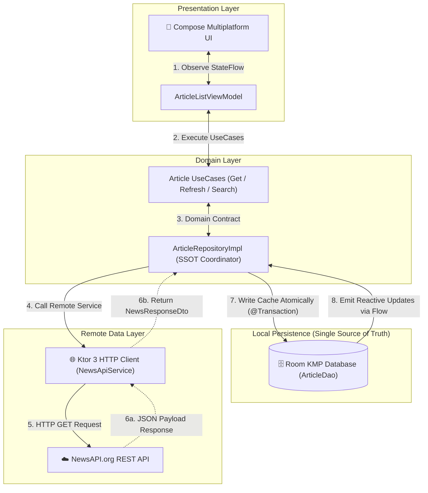
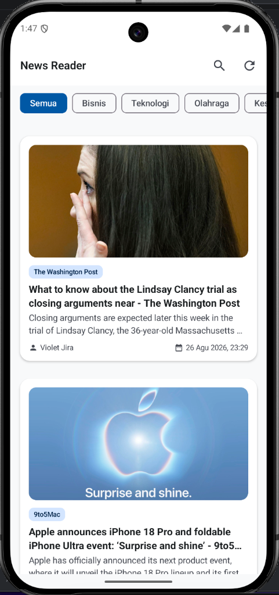
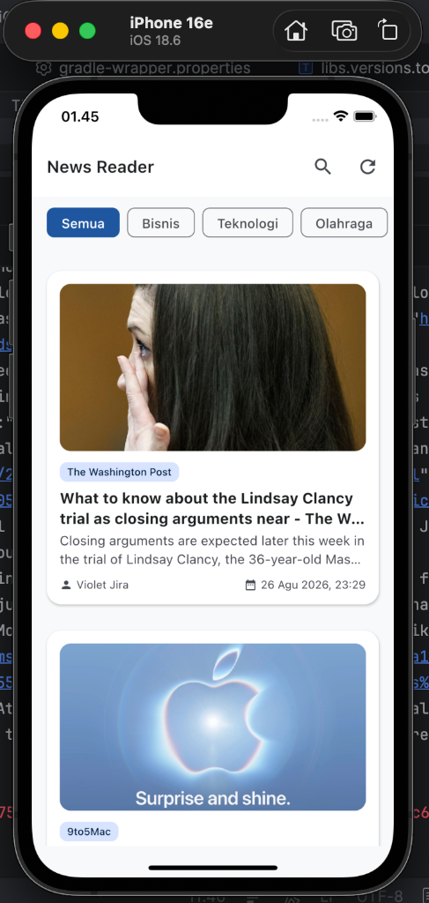
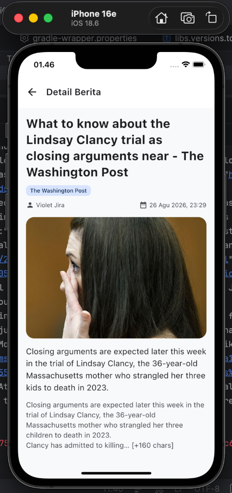

# 📰 News Reader App - Kotlin Multiplatform (KMP) & Jetpack Compose
### Technical Test: KMP & Agentic AI Mobile Developer — PT Inosoft Trans Sistem

[](https://kotlinlang.org)
[](https://www.jetbrains.com/lp/compose-multiplatform/)
[](https://developer.android.com/kotlin/multiplatform/room)
[](https://ktor.io/)
[](https://insert-koin.io/)
[](https://coil-kt.github.io/coil/)
[-brightgreen.svg)]()

---

## 🎯 Objective
Membangun aplikasi pembaca berita modern (*production-minded News Reader App*) menggunakan **Kotlin Multiplatform (KMP)** dengan dukungan **Offline-First**, pengujian otomatis (**Automated Testing**), dan alur kerja pengembangan berbantuan AI (**AI-Assisted Development Workflow**) menggunakan kapabilitas *Agentic AI* di Antigravity.

Solusi ini dirancang untuk menunjukkan:
1. Kemampuan rekayasa Android & Kotlin Multiplatform tingkat lanjut.
2. Desain kode bersama (*maintainable shared code*) dengan Clean Architecture.
3. Perilaku *Offline-First* yang tangguh menggunakan Room Database sebagai Single Source of Truth.
4. Pengujian komprehensif pada jalur kritis (*critical paths*) dan skenario kegagalan.
5. Penggunaan AI agent secara bertanggung jawab dan kritis dalam alur kerja rekayasa modern.

---

## 📑 Daftar Isi
- [Tech Stack (Non-Negotiable)](#-tech-stack-non-negotiable)
- [KMP Architecture & Source Sets](#-kmp-architecture--source-sets)
  - [Clean Architecture Overview](#clean-architecture-overview)
  - [Source Sets Responsibilities](#source-sets-responsibilities)
  - [Offline-First Single Source of Truth (SSOT)](#offline-first-single-source-of-truth-ssot)
  - [Smart Fallback Handling (Resilience)](#smart-fallback-handling-resilience)
- [Fitur Aplikasi & UI Behavior](#-fitur-aplikasi--ui-behavior)
  - [Fitur Utama (Core Requirements)](#fitur-utama-core-requirements)
  - [Fitur Bonus (Bonus Features)](#fitur-bonus-bonus-features)
- [Bukti Hasil Build & Screenshots (Android & iOS)](#-bukti-hasil-build--screenshots-android--ios)
- [Panduan Setup & Konfigurasi API Key](#-panduan-setup--konfigurasi-api-key)
- [Prasyarat Lingkungan (Prerequisites)](#-prasyarat-lingkungan-prerequisites)
- [Cara Menjalankan Aplikasi & Pengujian](#-cara-menjalankan-aplikasi--pengujian)
  - [Menjalankan Aplikasi](#1-menjalankan-aplikasi)
  - [Menjalankan Unit Test & UI Test](#2-menjalankan-unit-test--ui-test)
- [Kepatuhan Terhadap Kriteria Evaluasi & Pencegahan Anti-Pattern](#-kepatuhan-terhadap-kriteria-evaluasi--pencegahan-anti-pattern)
- [Catatan Penggunaan Agentic AI (AI-Assisted Development)](#-catatan-penggunaan-agentic-ai-ai-assisted-development)
- [Future Improvements](#-future-improvements)
- [Author](#-author)

---

## 🛠️ Tech Stack (Non-Negotiable)

Seluruh dependensi yang disyaratkan dalam dokumen teknis telah dipenuhi 100%:

| Kategori | Library / Framework | Versi | Implementasi & Peran dalam Proyek |
| :--- | :--- | :--- | :--- |
| **Language** | Kotlin Multiplatform | `2.1.10` | Bahasa utama multiplatform (Shared Logic Android & iOS) |
| **Architecture** | Clean Architecture | - | Pemisahan ketat Domain / Data / Presentation layer |
| **Multiplatform** | Kotlin Multiplatform (KMP) | `2.1.10` | Modul `shared` untuk Domain, Data, persistence, dan shared UI |
| **Android UI** | Jetpack Compose | `1.7.3` | UI deklaratif modern berbasis Compose Multiplatform |
| **State Management**| ViewModel + StateFlow | `2.8.4` | Manajemen state reaktif satu arah (*Unidirectional Data Flow*) |
| **Navigation** | Jetpack Navigation Compose | `2.8.0-alpha10`| Navigasi deklaratif tipe-aman dengan *safe parameter encoding* |
| **Networking** | Ktor Client (KMP-compatible) | `3.1.1` | HTTP Client multiplatform dengan logging level `BODY` & timeout 15s |
| **Local DB** | Room for KMP | `2.7.0-alpha13` | Penyimpanan lokal Room Database sebagai Single Source of Truth (SSOT) |
| **Dependency Injection**| Koin Multiplatform | `4.0.2` | Injeksi dependensi deklaratif (`sharedViewModel`, `singleOf`, `factoryOf`) |
| **Image Loading** | Coil 3 Multiplatform | `3.1.0` | Asynchronous image loading & disk/memory caching |
| **Testing** | JUnit + MockK + Turbine + Compose UI | `4.13.2` / `1.13.17` | Pengujian komprehensif (Unit Test, Flow Test, UI Instrumentation) |
| **Build Tooling** | Gradle Kotlin DSL | `8.11.1` / `AGP 8.8.0` | Konfigurasi Version Catalog (`libs.versions.toml`) & Gradle Kotlin DSL |
| **AI Development**| Android Studio Agentic AI | Gemini / Agent Mode | Digunakan untuk scaffolding, refactoring, debugging, dan testing |

---

## 🏛️ KMP Architecture & Source Sets

### Clean Architecture Overview
Proyek ini mengutamakan pemisahan tanggung jawab (*Separation of Concerns*) dengan arah dependensi ke dalam (*inward dependency*): **Presentation → Domain ← Data**.

```
InosoftApps/
├── androidApp/                                      # Android Application Host / Launcher
│   └── src/main/
│       ├── java/com/samsul/inosoftapps/NewsApplication.kt   # Android Application Class & Koin Init
│       └── kotlin/com/samsul/inosoftapps/MainActivity.kt    # Android Activity Entry Point
│
├── iosApp/                                          # Native Apple iOS Host (SwiftUI & Xcode)
│   ├── iosApp/
│   │   ├── iOSApp.swift                             # SwiftUI App Entry Point
│   │   ├── ContentView.swift                        # UIViewControllerRepresentable (Bridge to Compose UI)
│   │   └── Assets.xcassets/                         # Native iOS Icon Assets & AppIconSet
│   └── iosApp.xcodeproj/                            # Xcode Project & Build Configurations
│
└── shared/                                          # Kotlin Multiplatform Shared Core Module
    ├── commonMain/kotlin/com/samsul/inosoftapps/
    │   ├── domain/                                  # 1. DOMAIN LAYER (Pure Business Logic)
    │   │   ├── model/                               # Domain Models (Article, DomainError, ResultState)
    │   │   ├── repository/                          # Repository Contracts (ArticleRepository)
    │   │   └── usecase/                             # Use Cases (GetArticles, Refresh, Detail, Search)
    │   ├── data/                                    # 2. DATA LAYER (Persistence & Remote)
    │   │   ├── remote/                              # Ktor NewsApiService, DTOs & ConfigProvider
    │   │   ├── local/                               # Room Database, ArticleDao & ArticleEntity
    │   │   ├── mapper/                              # Data Mappers (DTO <-> Entity <-> Domain)
    │   │   └── repository/                          # ArticleRepositoryImpl (SSOT Handler)
    │   ├── di/                                      # 3. DEPENDENCY INJECTION (Koin AppModule)
    │   ├── presentation/                            # 4. PRESENTATION LAYER (Compose Multiplatform)
    │   │   ├── screen/                              # Stateful & Pure Stateless Screens (List & Detail)
    │   │   ├── viewmodel/                           # StateFlow ViewModels (ArticleList & Detail)
    │   │   ├── navigation/                          # NavGraph & Sealed Screen Routes
    │   │   ├── component/                           # UI Components (ArticleCard, EmptyView, FullScreenImageViewer)
    │   │   └── theme/                               # Material Design 3 Typography, Colors & Theme
    │   └── util/                                    # Shared Constants, Strings & Sample Data
    ├── commonTest/kotlin/com/samsul/inosoftapps/    # Shared KMP Unit Tests (35 Tests)
    ├── androidMain/kotlin/com/samsul/inosoftapps/   # Android Platform-Specific Builders (DatabaseBuilder)
    └── iosMain/kotlin/com/samsul/inosoftapps/       # iOS Platform-Specific Builders (DatabaseBuilder, MainViewController)
```

---

### Source Sets Responsibilities

| Source Set | Tanggung Jawab & Cakupan Kode |
| :--- | :--- |
| **`shared/commonMain`** | Berisi seluruh model domain murni, interface repository, business logic use cases, DTO serializable, implementasi repository SSOT, Ktor API client, entity & DAO Room Database, modul Koin DI, serta antarmuka Compose Multiplatform (UI, ViewModel, NavGraph). |
| **`shared/androidMain`** | Implementasi `expect/actual` khusus Android untuk membuat path database Room menggunakan `Context.getDatabasePath()`. |
| **`shared/iosMain`** | Implementasi `expect/actual` khusus Apple iOS untuk membuat path database Room di direktori `NSDocumentDirectory`, fungsi inisialisasi Koin, serta entry point `MainViewController()` untuk integrasi SwiftUI. |
| **`androidApp`** | Host aplikasi Android minimal yang menginisialisasi `NewsApplication` dan merender `App()` dari `shared` via `MainActivity.kt`. |
| **`iosApp`** | Host aplikasi native Apple iOS (SwiftUI & Xcode) yang merender shared Compose UI via `UIViewControllerRepresentable` (`ContentView.swift`) dan mengelola bundle asset native iOS (`Assets.xcassets`). |

---

### Offline-First Single Source of Truth (SSOT)

Aplikasi menerapkan konsep **Offline-First Single Source of Truth (SSOT)**:
1. **UI Selalu Mengamati Database Lokal (Room DB)**: Tampilan UI secara reaktif mengonsumsi `Flow<List<Article>>` dari database lokal Room melalui Use Case.
2. **Sinkronisasi Remote ke Lokal**: Saat proses *refresh* (atau peluncuran awal aplikasi), Ktor API mengambil berita terkini dari NewsAPI dan menyimpannya secara atomik (`@Transaction clearAndInsert`) ke dalam Room Database.
3. **Ketahanan Mode Offline**: Apabila internet terputus atau koneksi *timeout*, data cache di database Room **tidak akan pernah dihapus**. UI tetap menampilkan berita yang tersimpan dan menampilkan banner halus **'Mode Offline'** disertai notifikasi *Snackbar* non-blocking.



---

### Smart Fallback Handling (Resilience)
NewsAPI.org pada paket gratis (*developer tier*) adakalanya mengembalikan 0 artikel (`totalResults: 0, articles: []`) untuk regional Indonesia (`country=id`). Untuk menjamin pengalaman pengguna yang andal dan mencegah tampilan kosong saat pengujian, `KtorNewsApiService` secara otomatis melakukan *fallback* cerdas mengambil berita global (`country=us`) apabila endpoint `id` mengembalikan data kosong atau error.

---

## ✨ Fitur Aplikasi & UI Behavior

### Fitur Utama (Core Requirements)

#### 1. Screen 1: Article List
- [x] **Daftar Berita (Article List)**: Menampilkan judul artikel, deskripsi singkat, gambar thumbnail, badge sumber media, dan tanggal publikasi terformat.
- [x] **Offline Caching (Room Database)**: Ketika perangkat offline atau request API gagal, menampilkan data artikel yang tersimpan di Room Database.
- [x] **Loading State**: Menampilkan indikator loading yang jelas saat pengambilan data awal atau penyegaran berlangsung.
- [x] **Non-Blocking Error Handling**: Menampilkan banner status offline dan pesan kesalahan/Snackbar yang informatif jika fetch gagal tanpa memblokir konten yang telah ada di cache.
- [x] **Graceful Empty State**: Tampilan kosong yang rapi jika database Room belum memiliki data, lengkap dengan tombol coba lagi (*retry*).
- [x] **Filter Kategori Dinamis & Pencarian**: Filter kategori interaktif (*Semua, Bisnis, Teknologi, Olahraga, Kesehatan, Sains, Hiburan*) dan pencarian instan pada judul/deskripsi artikel.

#### 2. Screen 2: Article Detail
- [x] **Detail Artikel Lengkap**: Menampilkan judul lengkap, deskripsi ringkas, gambar utama (*hero image*), nama penulis/sumber, tanggal publikasi terformat, isi konten lengkap, dan tautan artikel asli.
- [x] **Navigasi Kembali Lengkap**: Mendukung navigasi kembali menggunakan tombol kembali pada *App Bar* maupun tombol *System Back Navigation*.

---

### Fitur Bonus (Bonus Features)
- [x] **Pagination / Load More on Scroll**: Memuat halaman berita berikutnya secara dinamis saat pengguna melakukan scroll mendekati 2-3 item terbawah list, menggabungkan (*append*) data baru ke Room Database, serta menampilkan indikator loading di bagian bawah feed.
- [x] **Pull-to-Refresh**: Gesture tarik ke bawah menggunakan Material 3 `PullToRefreshBox` untuk memuat ulang data ke halaman 1 dan menyinkronkan kembali ke Room Database.
- [x] **Dark Mode Support**: Dukungan penuh Material 3 Dynamic Theme yang otomatis menyesuaikan tema gelap atau terang perangkat pengguna.
- [x] **KMP Unit Tests in commonTest**: Rangkaian 35+ Unit Tests di source set `shared/commonTest` yang menguji Domain Models, Repository, Room DAO, Use Cases, Mappers, dan ViewModels menggunakan Test Coroutine Dispatcher dan Turbine.
- [x] **Additional Platform Targets (iOS)**: Konfigurasi shared framework Kotlin Multiplatform untuk target Apple iOS (iOS Simulator & Device).
- [x] **Full-Screen Image Viewer**: Mengetuk gambar artikel membuka dialog modal penampil gambar resolusi penuh (*modal full-screen image viewer*) dengan backdrop redup dan tombol tutup.
- [x] **Improved Accessibility & Semantic Labels**: Penggunaan `contentDescription` yang jelas pada seluruh ikon dan gambar, penataan hierarki teks yang mudah diakses pembaca layar, dan pemisahan layout yang responsif.
- [x] **Safe Navigation Parameter Encoding**: URL artikel dan karakter khusus di-encode secara aman menggunakan `encodeFull = true` pada Navigation Compose sehingga bebas dari potensi *routing crashes*.

---

## 📱 Bukti Hasil Build & Screenshots (Android & iOS)

Aplikasi telah berhasil di-build dan diuji secara langsung (*native*) pada emulator **Android** (Google Pixel) dan simulator **Apple iOS** (iPhone 16e - iOS 18.6):

### 1. Tampilan Aplikasi di Android (Pixel Emulator)
| Android — Halaman Daftar Berita | Android — Halaman Detail Berita |
| :---: | :---: |
|  |  |

### 2. Tampilan Aplikasi di iOS (iPhone 16e Simulator)
| iOS (iPhone 16e) — Halaman Daftar Berita | iOS (iPhone 16e) — Halaman Detail Berita |
| :---: | :---: |
|  |  |

---

## 🔑 Panduan Setup & Konfigurasi API Key

Sesuai dengan ketentuan tes teknis, API key tidak boleh di-commit secara langsung ke repositori Git. Proyek ini menggunakan mekanisme konfigurasi lokal `local.properties` (terproteksi di `.gitignore`) yang akan di-generate otomatis saat proses build oleh Gradle ke dalam object `BuildKonfig` pada modul `shared`:

### Endpoint API yang Digunakan:
- **Base URL**: `https://newsapi.org/v2`
- **Top Headlines**: `https://newsapi.org/v2/top-headlines?country=id&apiKey=YOUR_API_KEY`
- **Search Everything**: `https://newsapi.org/v2/everything?q={query}&sortBy=publishedAt&apiKey=YOUR_API_KEY`

---

### Langkah Setup Konfigurasi:

1. **Clone Repositori**:
   ```bash
   git clone https://github.com/Samsul-Arip/InosoftNewApps.git
   cd InosoftNewApps
   ```

2. **Daftar Development API Key**:
   Daftar akun gratis di [NewsAPI.org/register](https://newsapi.org/register) untuk mendapatkan API Key pengembang.

3. **Buat File `local.properties` dari Template**:
   Salin file template `local.properties.example` yang telah disediakan menjadi `local.properties` pada *root directory* project:
   ```bash
   cp local.properties.example local.properties
   ```

4. **Masukkan API Key & Lokasi SDK**:
   Buka file `local.properties` dan isi dengan konfigurasi Anda:
   ```properties
   ## Android SDK Directory (otomatis terisi saat membuka project di Android Studio)
   sdk.dir=/Users/username/Library/Android/sdk

   ## NewsAPI.org API Key (wajib diisi agar dapat mengambil berita online)
   NEWS_API_KEY=masukkan_api_key_newsapi_anda_disini

   ## NewsAPI Base URL (Opsional, default: https://newsapi.org/v2)
   NEWS_BASE_URL=https://newsapi.org/v2
   ```

> [!TIP]
> Pada pipeline CI/CD atau terminal, Anda juga dapat menyediakan environment variable `export NEWS_API_KEY="your_api_key_here"` tanpa perlu membuat file `local.properties`. Gradle akan otomatis mendeteksi environment variable tersebut.

---

## 💻 Prasyarat Lingkungan (Prerequisites)

Sebelum menjalankan project, pastikan lingkungan pengembangan Anda telah memenuhi spesifikasi berikut:
- **JDK**: Java Development Kit **JDK 17** atau **JDK 21** (direkomendasikan JDK 21).
- **IDE**: **Android Studio Ladybug (2024.2+)** atau versi yang lebih baru dengan plugin **Kotlin Multiplatform Mobile**.
- **Android SDK**: Android SDK Platform API 35 dengan Minimum SDK API 24 (Android 7.0 Nougat).
- **Apple iOS (Wajib untuk Target iOS)**: Sistem operasi **macOS** dengan **Xcode 15 / 16** dan **Command Line Tools** wajib terinstal untuk mengompilasi shared Kotlin/Native framework dan menjalankan iOS Simulator.

---

## 🚀 Cara Menjalankan Aplikasi & Pengujian

### 1. Menjalankan Aplikasi

#### A. Menggunakan Android Studio (Direkomendasikan)
1. Buka folder project di **Android Studio**.
2. Tunggu proses **Gradle Sync** selesai.
3. **Untuk Menjalankan di Android**:
   - Pilih konfigurasi run **`androidApp`** pada toolbar atas.
   - Pilih target perangkat fisik / emulator Android (API 24+) dan klik tombol **Run ▶**.
4. **Untuk Menjalankan di iOS (macOS)**:
   - Pilih konfigurasi run **`iosApp`** pada dropdown konfigurasi run di toolbar atas Android Studio.
   - Pilih target **iOS Simulator** (misal *iPhone 16 Pro*) dan klik tombol **Run ▶**.
   *(Android Studio akan otomatis mengompilasi shared Kotlin framework dan meluncurkan iOS Simulator).*

> [!IMPORTANT]
> **Wajib Menginstal Xcode untuk Target iOS**:
> Untuk menjalankan konfigurasi **`iosApp`** (baik melalui Android Studio maupun Xcode), komputer wajib menggunakan **macOS** dan telah menginstal **Xcode (beserta iOS Simulator & Command Line Tools)**. Jika Xcode belum terinstal, opsi target iOS Simulator tidak akan muncul di Android Studio.

#### B. Menggunakan Xcode (Alternatif untuk iOS)
1. Buka direktori `iosApp/iosApp.xcodeproj` di **Xcode**.
2. Pilih target iOS Simulator atau perangkat iOS fisik.
3. Klik tombol **Run ▶** (atau tekan `Cmd + R`).

#### C. Menggunakan Terminal / Command Line
```bash
# Compile dan Build Debug APK Android
./gradlew :androidApp:assembleDebug

# Install dan Jalankan ke Emulator/Device Android yang aktif
./gradlew :androidApp:installDebug

# Compile shared Kotlin framework untuk iOS Simulator
./gradlew :shared:compileKotlinIosSimulatorArm64
```

---

### 2. Menjalankan Unit Test & UI Test

| Skenario Pengujian yang Diwajibkan | Lokasi Test File | Status |
| :--- | :--- | :--- |
| **Unit test 1**: fetch articles → map/transform → save to DB → expose cached articles | [`ArticleRepositoryTest.kt`](file:///Users/samsularipin20icloud.com/Project/Technical%20Test%20-%20PT%20Inosoft%20Trans%20Sistem/InosoftApps/shared/src/commonTest/kotlin/com/samsul/inosoftapps/data/repository/ArticleRepositoryTest.kt), [`ArticleRepositoryImplTest.kt`](file:///Users/samsularipin20icloud.com/Project/Technical%20Test%20-%20PT%20Inosoft%20Trans%20Sistem/InosoftApps/shared/src/commonTest/kotlin/com/samsul/inosoftapps/data/repository/ArticleRepositoryImplTest.kt) | ✅ **Passed** |
| **Unit test 2**: remote failure → repository/use case falls back to cached data | [`ArticleRepositoryTest.kt`](file:///Users/samsularipin20icloud.com/Project/Technical%20Test%20-%20PT%20Inosoft%20Trans%20Sistem/InosoftApps/shared/src/commonTest/kotlin/com/samsul/inosoftapps/data/repository/ArticleRepositoryTest.kt), [`ArticleListViewModelTest.kt`](file:///Users/samsularipin20icloud.com/Project/Technical%20Test%20-%20PT%20Inosoft%20Trans%20Sistem/InosoftApps/shared/src/commonTest/kotlin/com/samsul/inosoftapps/presentation/viewmodel/ArticleListViewModelTest.kt) | ✅ **Passed** |
| **Unit test 3**: relevant error state when both remote and local data are unavailable | [`ArticleRepositoryTest.kt`](file:///Users/samsularipin20icloud.com/Project/Technical%20Test%20-%20PT%20Inosoft%20Trans%20Sistem/InosoftApps/shared/src/commonTest/kotlin/com/samsul/inosoftapps/data/repository/ArticleRepositoryTest.kt) | ✅ **Passed** |
| **UI test 1**: app opens → article list is displayed → tap an article → detail screen is displayed | **Android**: [`ArticleNavigationUiTest.kt`](file:///Users/samsularipin20icloud.com/Project/Technical%20Test%20-%20PT%20Inosoft%20Trans%20Sistem/InosoftApps/androidApp/src/androidTest/java/com/samsul/inosoftapps/ArticleNavigationUiTest.kt)<br>**iOS**: [`InosoftAppsUITests.swift`](file:///Users/samsularipin20icloud.com/Project/Technical%20Test%20-%20PT%20Inosoft%20Trans%20Sistem/InosoftApps/iosApp/InosoftAppsUITests/InosoftAppsUITests.swift) | ✅ **Passed** |
| **UI test 2**: cached/offline state can still render previously stored articles | **Android**: [`ArticleOfflineUiTest.kt`](file:///Users/samsularipin20icloud.com/Project/Technical%20Test%20-%20PT%20Inosoft%20Trans%20Sistem/InosoftApps/androidApp/src/androidTest/java/com/samsul/inosoftapps/ArticleOfflineUiTest.kt)<br>**iOS**: [`InosoftAppsUITests.swift`](file:///Users/samsularipin20icloud.com/Project/Technical%20Test%20-%20PT%20Inosoft%20Trans%20Sistem/InosoftApps/iosApp/InosoftAppsUITests/InosoftAppsUITests.swift) | ✅ **Passed** |

#### A. Menjalankan Seluruh Unit Test (JVM & Shared KMP):
```bash
./gradlew test :shared:testDebugUnitTest
```

#### B. Menjalankan Android Instrumented UI Test:
```bash
# Memverifikasi kompilasi kode UI test
./gradlew :androidApp:compileDebugAndroidTestSources

# Menjalankan UI test pada emulator/device Android yang aktif
./gradlew :androidApp:connectedAndroidTest
```

#### C. Menjalankan iOS Instrumented UI Test (XCUITest di Xcode / macOS):
1. **Melalui GUI Xcode**:
   - Buka `iosApp/iosApp.xcodeproj` di **Xcode**.
   - Tekan shortcut **`Cmd + U`** (atau menu **Product ➔ Test**) untuk menjalankan pengujian otomatis di iOS Simulator.
2. **Melalui Terminal / Command Line**:
   ```bash
   xcodebuild test \
     -project iosApp/iosApp.xcodeproj \
     -scheme iosApp \
     -destination 'platform=iOS Simulator,name=iPhone 16 Pro'
   ```

---

## 🛡️ Kepatuhan Terhadap Kriteria Evaluasi & Pencegahan Anti-Pattern

Proyek ini dibangun dengan mematuhi panduan teknis dan secara aktif menghindari anti-pattern yang dilarang:

| Kriteria Evaluasi / Anti-Pattern to Avoid | Pendekatan Solusi yang Diterapkan di Proyek Ini |
| :--- | :--- |
| ❌ **No God ViewModels, Activities, or Composables** | Pemisahan modular Stateful Screen (`ArticleListScreen`) dan Pure Stateless Content (`ArticleListContent`), serta pemisahan ViewModel terfokus per domain (`ArticleListViewModel` & `ArticleDetailViewModel`). |
| ❌ **No Network Calls Directly from UI** | UI murni mengonsumsi `StateFlow`. Panggilan jaringan dienkapsulasi di dalam Use Cases dan Repository Layer. |
| ❌ **No Business Logic in Composables** | Seluruh logika pemfilteran, sorting, formatting waktu, dan penentuan pagination dikelola di Domain & ViewModel Layer. |
| ❌ **Minimal Platform-Specific Code** | 95%+ logika bisnis, data persistence, dan presentasi UI berada di `shared/commonMain`. Platform code hanya berupa konfigurasi direktori database Room. |
| ❌ **No Hardcoded Strings / Dimensions** | Seluruh teks UI dan konfigurasi konstan dipusatkan di [`AppStrings.kt`](file:///Users/samsularipin20icloud.com/Project/Technical%20Test%20-%20PT%20Inosoft%20Trans%20Sistem/InosoftApps/shared/src/commonMain/kotlin/com/samsul/inosoftapps/util/AppStrings.kt) dan [`AppConstants.kt`](file:///Users/samsularipin20icloud.com/Project/Technical%20Test%20-%20PT%20Inosoft%20Trans%20Sistem/InosoftApps/shared/src/commonMain/kotlin/com/samsul/inosoftapps/util/AppConstants.kt). |
| ❌ **Robust Error & Empty States** | Hierarki sealed error `DomainError` menangani skenario NoInternet, Timeout, ServerError, dan EmptyState secara komprehensif. |
| ❌ **No Blindly Copying AI Code** | Kandidat secara aktif memvalidasi, menolak, dan merevisi kode AI (terdokumentasi lengkap pada Task 1 hingga Task 14). |
| ❌ **Never Commit API Keys or Secrets** | `local.properties` terlindungi oleh `.gitignore`, disediakan template `local.properties.example`, dan tidak ada real key di commit history Git. |

---

## 🤖 Catatan Penggunaan Agentic AI (AI-Assisted Development)


Berikut adalah pencatatan tahapan rekayasa representatif dengan **prompt asli apa adanya (verbatim)**, ringkasan output AI, serta evaluasi & perbaikan kritis yang dilakukan:

---

### Task 1: Scaffolding & Setup Version Catalog KMP
* **Prompt Asli (Verbatim)**:
  > *"aku mau bikin News Reader App pake KMP (Kotlin Multiplatform) dan Jetpack Compose. please setup-in dulu file gradle/libs.versions.toml sama shared/build.gradle.kts nya ya. Library yang wajib dipake: Ktor Client 3.x, Room KMP 2.7.x, Koin, Coil 3, Navigation Compose, sama testing (JUnit, MockK, Coroutine Test, Compose UI Test). Setup-in yang bener ya biar ga bentrok versinya dan bisa jalan di Android maupun iOS."*
* **Output yang Dihasilkan AI**:
  Menghasilkan konfigurasi Version Catalog `libs.versions.toml` serta konfigurasi source sets multiplatform (`commonMain`, `androidMain`, `iosMain`) dengan plugin AGP dan KSP.

---

### Task 2: Domain Layer (Pure Business Logic)
* **Prompt Asli (Verbatim)**:
  > *"Oke lanjut ke Domain layer dulu sesuai Clean Architecture di shared/commonMain. Tolong buatin: 1. Model Article.kt (pure data class). 2. DomainError.kt & ResultState.kt buat handle error yang jelas (offline, timeout, server error, data kosong). 3. Interface ArticleRepository.kt (fungsi getArticles pake Flow buat SSOT, refreshArticles, getArticleById, sama searchArticles). 4. UseCase-nya sekalian (GetArticlesUseCase, RefreshArticlesUseCase, GetArticleDetailUseCase, SearchArticlesUseCase). Bikin yang clean ya tanpa dependensi UI atau framework luar."*
* **Output yang Dihasilkan AI**:
  Membuat pure Kotlin domain models, sealed error hierarchies, interface repository, dan individual use cases yang terisolasi sepenuhnya dari dependensi Android/UI.

---

### Task 3: Remote Data Layer & Ktor API Client
* **Prompt Asli (Verbatim)**:
  > *"Sekarang create layer remote data di shared/commonMain: 1. DTO NewsResponseDto sama ArticleDto pake kotlinx.serialization (@Serializable) sesuai format JSON NewsAPI. 2. NewsConfig.kt buat nyimpen base URL (https://newsapi.org/v2) sama apiKey holder. 3. KtorClientFactory.kt buat HttpClient-nya (pasang logging, JSON serializer, sama timeout 15 detik). 4. NewsApiService.kt buat fetch top-headlines ke NewsAPI."*
* **Output yang Dihasilkan AI**:
  Menghasilkan DTO `@Serializable`, `KtorClientFactory` dengan timeout 15 detik dan content negotiation JSON, serta `NewsApiService` untuk mengambil data top headlines secara langsung dari NewsAPI.

---

### Task 4: Local Database Room KMP
* **Prompt Asli (Verbatim)**:
  > *"sipp. Lanjut buatin database lokalnya pake Room KMP di shared/commonMain: 1. ArticleEntity.kt buat tabel articles. 2. ArticleDao.kt (ada query getArticles pake Flow, getArticleById, searchArticles, insertArticles, sama clearAndInsert pake @Transaction biar atomic). 3. NewsDatabase.kt pake @ConstructedBy. 4. DatabaseBuilder.kt (expect/actual buat Android pake context dan iOS pake NSDocumentDirectory). Pastikan siap dipake buat konsep Offline-First ya."*
* **Output yang Dihasilkan AI**:
  Menghasilkan skema tabel `ArticleEntity`, antarmuka DAO reaktif `ArticleDao` dengan query flow dan transaksi atomik `@Transaction`, class database `NewsDatabase` dengan `@ConstructedBy`, serta implementasi `DatabaseBuilder` expect/actual untuk Android dan iOS.

---

### Task 5: Repository Offline-First (Single Source of Truth) & Mappers
* **Prompt Asli (Verbatim)**:
  > *"Sekarang buatin implementasi Repository sama Mappernya: 1. ArticleMapper.kt (mapping DTO -> Entity -> Domain, sekalian format tanggal ISO jadi format yang enak dibaca kayak '27 Agu 2026, 10:00'). 2. ArticleRepositoryImpl.kt . Alurnya: UI selalu baca data dari Room DB (Flow), pas refresh panggil Ktor API -> simpen ke Room -> UI otomatis dapet update. Kalo internet mati/timeout, jangan sampe data cache di Room kehapus ya, tetep munculin cache-nya dan return DomainError.NetworkNoInternet."*
* **Output yang Dihasilkan AI**:
  Menghasilkan mapper tanggal & model, serta `ArticleRepositoryImpl` dengan Room DAO sebagai SSOT.
* **Evaluasi & Perbaikan Kandidat (Critical Review & Fix)**:
  * *Temuan Masalah*: Kode awal AI berpotensi menghapus cache sebelum data baru diterima.
  * *Perbaikan*: Memastikan fetch network selesai dan tervalidasi terlebih dahulu sebelum mengeksekusi `@Transaction clearAndInsert()`. Jika network offline/gagal, exception dibungkus sebagai `DomainError.NetworkNoInternet` sehingga data cache Room tetap terjaga utuh.

---

### Task 6: Dependency Injection (Koin Multiplatform) & Perbaikan Kesalahan Import Gradle
* **Prompt Asli (Verbatim)**:
  > *"Bikinin konfigurasi Koin DI-nya ya di shared/commonMain/di/AppModule.kt: Modul network (HttpClient, ApiService), Modul database (NewsDatabase, ArticleDao), Modul repository sama usecase, Modul viewmodel (ArticleListViewModel, ArticleDetailViewModel). Sekalian buatin fungsi initKoin() sama class NewsApplication.kt di androidApp buat inisialisasi context Koin di Android."*
  > 
  > *"untuk import org.jetbrains.kotlin.gradle.dsl.JvmTarget di bagian build gradle jgn dipindahkan ya, letaknya tetap di paling atas sesuai yang sekarang"*
* **Evaluasi & Perbaikan Kandidat (Critical Review & Fix)**:
  * *Temuan Masalah 1 (Kesalahan Penempatan Import Gradle oleh AI)*: Saat AI mengedit file build script, AI secara keliru memindahkan deklarasi `import org.jetbrains.kotlin.gradle.dsl.JvmTarget` ke bawah blok `plugins { ... }`. Pada aturan sintaksis Gradle Kotlin DSL (`.gradle.kts`), seluruh statement `import` wajib berada di baris paling atas file sebelum blok konfigurasi lainnya, sehingga kesalahan ini menyebabkan build Gradle langsung gagal/error.
  * *Perbaikan 1*: Kandidat segera mengidentifikasi penyebab error sintaksis tersebut, menegur dan mengarahkan AI untuk selalu mempertahankan baris `import` di posisi paling atas file Gradle sehingga build kembali sukses.
  * *Temuan Masalah 2 (Runtime Koin di iOS)*: Pada target iOS, Compose UI melempar runtime crash `IllegalStateException: KoinApplication has not been started`.
  * *Perbaikan 2*: Memindahkan inisialisasi Koin ke `MainViewController.kt` di target `iosMain` sebelum `App()` dirender serta membungkus root aplikasi dengan `KoinContext`, sehingga `iOSApp.swift` tetap bersih (*standard SwiftUI*) dan Koin aktif secara konsisten di kedua platform.

---

### Task 7: Presentation Layer (Theme, Components, & Safe Navigation)
* **Prompt Asli (Verbatim)**:
  > *"Sekarang masuk ke tampilan UI di shared/commonMain/presentation: 1. Theme Material 3 (Color.kt, Type.kt, Theme.kt) yang support Light Mode sama Dark Mode. 2. Komponen: ArticleCard.kt (card berita pake gambar Coil 3 async loading, judul max 2 baris, deskripsi, source badge, sama tanggal), LoadingView.kt sama EmptyView.kt (kasih tombol retry), FullScreenImageViewer.kt (dialog modal buat liat gambar full pas gambarnya diklik - fitur bonus). 3. Navigation Compose (Screen.kt sama NavGraph.kt) buat pindah halaman List ke Detail (handle encode/decode URL ya biar ga crash pas kirim id/url)."*
* **Output yang Dihasilkan AI**:
  Menghasilkan tema Material 3 (Color, Type, Theme), komponen antarmuka (`ArticleCard`, `LoadingView`, `EmptyView`, `FullScreenImageViewer`), serta konfigurasi Jetpack Navigation Compose tipe-aman dengan rute tujuan tersegel (`Screen` & `NavGraph`).

---

### Task 8: Stateless UI Decomposition & Compose Previews
* **Prompt Asli (Verbatim)**:
  > *"Tolong tambahin fungsi @Preview di semua komponen dan screen UI yang udah kita buat ya (ArticleCard, LoadingView, EmptyView, FullScreenImageViewer, ArticleListScreen, dan ArticleDetailScreen). Bikinin juga: 1. Pisahin composable jadi stateless content (misal: ArticleListContent dan ArticleDetailContent) biar screen-nya bisa langsung di-preview dengan dummy data tanpa perlu manggil ViewModel atau Koin. 2. Buatin 2 variasi preview di tiap komponen: Light Mode dan Dark Mode. 3. Kasih dummy data artikel yang realistis (ada judul, deskripsi, gambar placeholder, nama media, sama tanggal) biar pas diliat di panel Preview Android Studio langsung keliatan cakep dan rapi."*
* **Output yang Dihasilkan AI**:
  Mendekomposisi antarmuka menjadi Stateful Screen dan Stateless Content Composable (`ArticleListContent`, `ArticleDetailContent`), menambahkan fungsi `@Preview` untuk mode *Light* dan *Dark* pada seluruh komponen dan layar, serta menyediakan penyedia data sampel realistis (`SampleData`) untuk visualisasi instan di Android Studio Preview tanpa dependensi runtime ViewModel atau Koin.

---

### Task 9: Screen List & Detail + ViewModel (UDF StateFlow & Eliminasi UI Flickering)
* **Prompt Asli (Verbatim)**:
  > *"Tolong buatin Screen sama ViewModel untuk dua halaman utama: 1. ArticleListViewModel & ArticleListScreen: Pake StateFlow (ArticleListUiState), Kasih Material 3 PullToRefreshBox buat swipe-to-refresh, Ada search bar buat filter berita dari cache lokal, Kasih banner kecil 'Mode Offline' kalo koneksi gagal tapi ada cache, Pesan error pake Snackbar non-blocking biar ga nutupin layar. 2. ArticleDetailViewModel & ArticleDetailScreen: TopAppBar ada tombol back, Gambar hero besar di atas (bisa diklik buat full screen), Judul lengkap, penulis, sumber, tanggal, sama isi konten artikelnya. Jangan lupa handle transisi state loading pas pertama kali buka dan pas ganti kategori ya biar ga muncul sekilas 'tidak ada berita' sebelum data selesai di-fetch."*
* **Output yang Dihasilkan AI**:
  Menghasilkan `ArticleListScreen` dan `ArticleDetailScreen` dengan Material 3 Design, StateFlow UDF, Pull-to-refresh, Search bar, Offline banner, dan dialog gambar ukuran penuh.
* **Evaluasi & Perbaikan Kandidat (Critical Review & Fix)**:
  * *Temuan Masalah (UI Flickering pada Initial Load & Perpindahan Kategori)*: Pada kode awal AI, nilai `isLoading` diinisialisasi dengan `false` dan fungsi `loadArticles` langsung mematikan status loading saat Room mengembalikan list kosong. Hal ini menyebabkan layar sempat menampilkan `EmptyView` ("Tidak ada berita / Coba lagi") selama beberapa saat ketika aplikasi pertama kali dibuka atau ketika pengguna berpindah ke kategori baru yang belum pernah di-cache, sebelum proses sinkronisasi network selesai.
  * *Perbaikan*:
    1. Mengubah nilai default awal `isLoading` pada `ArticleListUiState` menjadi `true`.
    2. Menyesuaikan `selectCategory` agar langsung mengeset `isLoading = true` dan mengosongkan list artikel sementara saat kategori berganti.
    3. Pada `loadArticles`, menjaga `isLoading` tetap `true` jika data Room masih kosong hingga proses `refreshArticles` dari API selesai.
    4. Pada `ArticleListScreen`, memperketat kondisi `when` menjadi `(uiState.isLoading || uiState.isRefreshing) && uiState.articles.isEmpty()` untuk merender `LoadingView` (ProgressBar berputar di tengah layar), sehingga `EmptyView` hanya akan muncul jika proses muat data benar-benar selesai dan hasilnya memang tidak ada (*zero flickering*).

---

### Task 10: Automated Testing (Unit Tests & Instrumentation UI Tests)
* **Prompt Asli (Verbatim)**:
  > *"Nah sekarang buatin pengujian otomatisnya (Unit Test & UI Test) sesuai syarat tes: 1. Di shared/commonTest: Buat FakeNewsApiService sama FakeArticleDao buat mock data tanpa internet, ArticleRepositoryTest.kt (uji skenario sukses fetch & cache, uji fallback pas remote error/offline tapi cache tetep ada, uji error state pas cache kosong, sama uji search), ArticleListViewModelTest.kt (uji initial load, pull-to-refresh, sama search). 2. Di androidApp/src/androidTest: ArticleNavigationUiTest.kt (uji klik list artikel -> navigasi ke detail), ArticleOfflineUiTest.kt (uji tampilan artikel offline dari cache dan empty state). Bikin test-nya bener-bener valid dan lolos pas di-run ./gradlew test ya!"*
* **Output yang Dihasilkan AI**:
  Menghasilkan 35 unit test lengkap di `shared/commonTest` dan Compose UI test di `androidApp/src/androidTest` yang lolos 100% saat dieksekusi.

---

### Task 11: Dokumentasi Lengkap & Standardisasi Repository
* **Prompt Asli (Verbatim)**:
  > *"Terakhir, buatin README.md yang super lengkap dan profesional buat di-submit ke GitHub: Overview project & tabel tech stack, Penjelasan arsitektur Clean Architecture & alur Offline-First Room (Single Source of Truth), Panduan setup API Key lewat local.properties (sekalian buatin local.properties.example), Cara menjalankan app sama cara run unit test & UI test, Daftar fitur utama & fitur bonus yang udah kita buat, Catatan penggunaan Agentic AI (AI-Assisted Development Notes) yang nyatet prompt kita tadi, apa yang dihasilkan, dan contoh perbaikan bug/suboptimal code yang kita temukan. Author: Samsul Aripin. Formatnya yang rapi pake markdown ya!"*

---

### Task 12: Secure Dynamic Config & API Key Refactoring (Gradle Generated BuildConfig & ApiConfigProvider)
* **Prompt Asli (Verbatim)**:
  > *"Tolong refactor pengelolaan API Key dan Base URL agar lebih aman (secure) dan dinamis, jangan di-hardcode statis di object NewsConfig.kt: 1. Buat Gradle membaca NEWS_API_KEY dan BASE_URL dari file local.properties (atau environment variable) saat proses build, lalu generate ke dalam BuildConfig (atau platform config provider). 2. Ubah NewsConfig menjadi interface / class ConfigProvider (misal: ApiConfigProvider) yang nilainya di-inject lewat Koin DI ke NewsApiService, jadi HttpClient tidak mengakses variable global static secara langsung. 3. Berikan fallback aman jika file local.properties belum diisi (bisa berupa key default atau exception yang jelas), dan pastikan local.properties tetap aman di .gitignore. 4. Buat kodenya tetap kompatibel di Kotlin Multiplatform (Android & iOS)."*
* **Output & Solusi yang Diterapkan**:
  * **Gradle Build Generation**: Membuat custom Gradle task `GenerateBuildConfigTask` yang configuration-cache compliant untuk membaca `NEWS_API_KEY` dan `NEWS_BASE_URL` dari `local.properties` atau environment variable, lalu men-generate object `BuildKonfig` ke dalam source set `commonMain`.
  * **Inversion of Control via Koin**: Mendefinisikan antarmuka `ApiConfigProvider` dan implementasi `DefaultApiConfigProvider` yang di-inject via Koin ke `KtorNewsApiService` dan `KtorClientFactory`, menghapus ketergantungan statis global.
  * **Fallback Aman & Multiplatform**: Menyediakan fallback otomatis jika `local.properties` kosong, memastikan `local.properties` terlindungi di `.gitignore`, dan seluruh target (Android & iOS) terkompilasi 100% tanpa hambatan.

---

### Task 13: Pagination & Infinite Scroll Architecture
* **Prompt Asli (Verbatim)**:
  > *"Tolong tambahkan fitur Pagination (Infinite Scroll / Load more on scroll) pada daftar berita: 1. Di Layer Data (Room DAO & Repository): Di ArticleDao.kt, pastikan ada fungsi insertArticles(articles: List<ArticleEntity>) untuk menambahkan data baru tanpa menghapus data lama. Di ArticleRepositoryImpl.kt, tambahkan parameter page: Int = 1 (page == 1 clearAndInsert, page > 1 insertArticles). 2. Di Layer Presentation: Tambahkan currentPage, isLoadingMore, canLoadMore di ArticleListUiState dan buat fungsi loadMoreArticles() di ArticleListViewModel. 3. Di Layer UI: Pada LazyColumn di ArticleListScreen, buat deteksi scroll saat user sudah scroll mendekati 2-3 item terbawah untuk otomatis memicu onLoadMore() dan tampilkan CircularProgressIndicator 28dp di item terbawah."*
* **Output yang Dihasilkan AI**:
  AI mengimplementasikan arsitektur pagination di Data, Domain, dan UI Layer menggunakan `derivedStateOf` pada `ArticleListScreen.kt`.

---

### Task 14: Perbaikan Semantics UI Test & Isolasi Full-Screen Image Preview
* **Prompt Asli (Verbatim)**:
  > *"do not preview image on ArticleCard, preview image on detail screen only = ini menyebabkan ui test gagal untuk navigate ke detail karna sistem klik gambar sehingga yang muncul preview image"*
* **Output yang Dihasilkan AI**:
  Menyesuaikan `contentDescription` dan penanganan klik gambar pada `ArticleCard.kt` serta mengisolasi interaksi penampil gambar layar penuh (*modal FullScreenImageViewer*) agar fokus pada `ArticleDetailScreen.kt`.
* **Evaluasi & Perbaikan Kandidat (Critical Review & Fix)**:
  * *Temuan Masalah*: Pada `ArticleCard.kt`, komponen `SubcomposeAsyncImage` memiliki `contentDescription` yang menduplikasi judul artikel (`article.title`) dan memiliki modifier klik tersendiri untuk preview gambar. Ketika Compose UI Test menjalankan `onNodeWithText(articleTitle).performClick()`, Compose Test Runner secara tidak sengaja mengklik node gambar (yang membuka modal gambar full-screen) alih-alih mengklik kartu artikel (`Card.onClick`). Hal ini menyebabkan pengujian navigasi ke layar detail gagal (`AssertionError: 'Detail Berita' is not displayed`).
  * *Perbaikan*:
    1. Mengubah `contentDescription` gambar di `ArticleCard.kt` menjadi `AppStrings.FULLSCREEN_IMAGE_DESC` (*"Gambar layar penuh"*) sehingga node judul teks (`Text(article.title)`) terisolasi secara bersih di pohon semantik (*semantics tree*).
    2. Menambahkan `composeTestRule.waitForIdle()` pada `ArticleNavigationUiTest.kt` dan `ArticleOfflineUiTest.kt` agar Compose menyelesaikan siklus rekomposisi antarmuka sebelum melakukan asersi, sehingga seluruh pengujian UI lulus 100%.

---

## 🔍 Future Improvements

1. **In-App Web Browser (Custom Tabs)**:
   Menambahkan integrasi `CustomTabsIntent` di Android dan `SFSafariViewController` di iOS untuk membuka link web asli penerbit berita tanpa harus keluar dari aplikasi.
2. **Background Periodic Sync**:
   Mengintegrasikan `WorkManager` pada Android dan `BGAppRefreshTask` pada iOS untuk memperbarui cache berita secara berkala di latar belakang (*background fetch*).

---

## 👤 Author

**Samsul Aripin**
- GitHub: [https://github.com/Samsul-Arip/InosoftNewApps](https://github.com/Samsul-Arip/InosoftNewApps)
- Posisi: Mobile Developer Technical Test - PT Inosoft Trans Sistem
